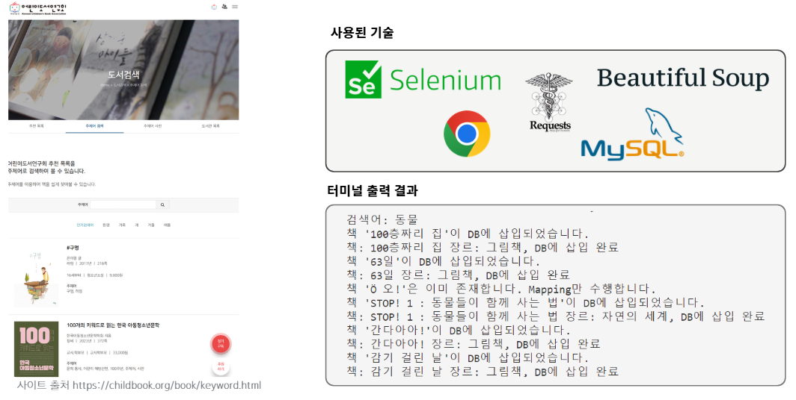
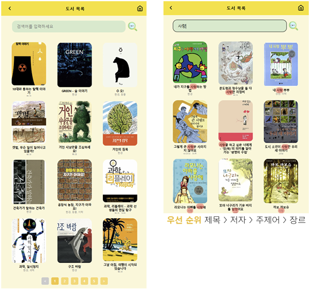
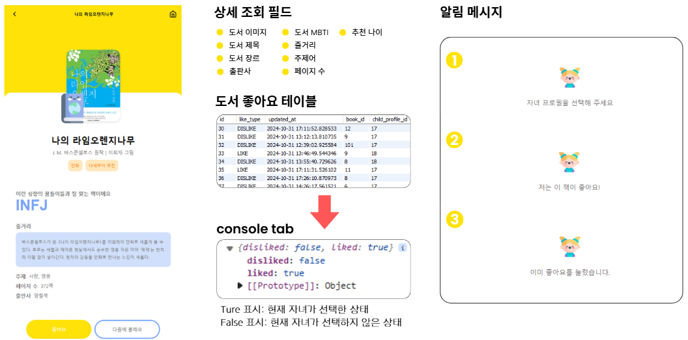
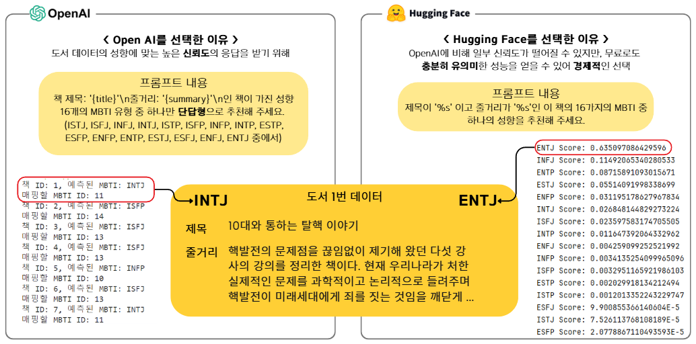
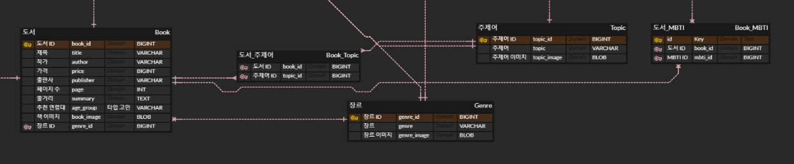

# 📚 꿈틀 (Ggumtle)

꿈틀은 어린이를 위한 MBTI 기반 성향 진단 서비스를 제공하고, 진단 결과를 바탕으로 맞춤형 도서를 추천하는 웹 플랫폼입니다.

도서 데이터를 직접 크롤링하여 구축하고, OpenAI API와 Hugging Face 모델을 활용해 도서의 주제와 내용을 분석하여 MBTI를 예측하는 추천 시스템을 구현했습니다.

또한 선착순 이벤트 기능을 통해 대규모 사용자 요청을 처리할 수 있도록 설계하여 실제 서비스 환경을 고려한 프로젝트를 진행했습니다.

## 주요 특징 및 기능

- 📖 **MBTI 기반 성향 진단** : 어린이 맞춤 설문을 통해 성향 분석
- 🤖 **AI 기반 도서 추천** : OpenAI API와 Hugging Face를 활용한 MBTI 예측 및 추천
- ❤️ **도서 좋아요 / 싫어요** : 사용자 선호도를 반영한 독서 관리
- 🔍 **도서 검색** : 제목, 저자, 주제어, 장르 기반 검색
- 🎁 **이벤트 시스템** : 선착순 응모 기능을 통한 대규모 트래픽 처리
- 📊 **성향 히스토리** : MBTI 변화와 선호 장르 변화 확인

## 사용 기술

| 구분 | 기술 |
|------|------|
| **Frontend** | React, Axios |
| **Backend** | Java 17, Spring Boot 3.3, Spring Security, JWT, Spring Data JPA (Hibernate), MySQL, Lombok, ModelMapper, Validation |
| **AI** | OpenAI API (GPT-3.5/4), Hugging Face |
| **Collaboration** | Git, GitHub, Notion, Slack, Zoom, Gather, Postman, ERDCloud, Canva |

## 내가 기여한 부분

### 📚 도서 데이터 크롤링

- 10,000건 이상의 도서 데이터 수집
- 도서 데이터 크롤링
- 장르 및 주제어 데이터 구축
- 도서-장르, 도서-주제어 외래키 매핑

### 🔍 도서 목록 및 검색 기능

- 도서 목록 조회 API 구현
- 검색 기능 개발 (Frontend & Backend)
- **검색 우선순위 적용**
  - 제목
  - 저자
  - 주제어
  - 장르

### 📖 도서 상세 페이지

- 도서 상세 조회 기능 구현
- 좋아요 / 싫어요 기능 구현
- 프론트엔드와 백엔드 전체 개발

### 🤖 AI 기반 MBTI 추천 시스템

- OpenAI API를 활용한 도서 MBTI 분석
- Hugging Face 모델을 활용한 관리자용 MBTI 분류 기능 구현

### 🤝 협업

- Git & GitHub 기반 협업 환경 구축
- Notion을 활용한 프로젝트 문서화
- PR 기반 코드 리뷰 문화 정착에 기여
- 프로젝트 컨벤션 수립 참여

## 트러블슈팅 및 극복 과정

### 🚨 문제

도서 데이터를 크롤링하여 데이터베이스에 저장하는 과정에서 **도서-장르**, **도서-주제어** 관계를 설정하는 데 어려움이 있었습니다.

장르와 주제어는 하나의 도서에 여러 개가 존재하는 다대다(M:N) 관계였으며, 중복 데이터가 발생하는 문제가 있었습니다.

### 🔍 원인 분석

기존 로직은

- 장르를 하나만 저장
- 주제어를 하나만 저장
- 중복 여부를 검사하지 않고 관계 테이블에 삽입

하는 방식이었습니다.

이로 인해

- 중복 데이터 생성
- 잘못된 외래키 매핑
- 데이터 무결성 저하

문제가 발생했습니다.

### ✅ 해결 과정

- Book-Genre 매핑 테이블 설계
- Book-Topic 매핑 테이블 설계
- JSON 데이터를 분리하여 각각 저장
- INSERT 전 중복 여부 확인
- 이미 존재하는 관계는 저장하지 않도록 로직 개선

### 📈 개선 결과

- 중복 데이터 제거
- 다대다 관계 정상 구성
- 외래키 무결성 확보
- 도서 검색 및 추천 정확도 향상

### 💡 배운 점

이번 경험을 통해 **다대다(M:N) 관계에서는 매핑 테이블 설계가 매우 중요하다**는 점을 배웠습니다.

또한 JSON과 같은 복수 데이터를 저장할 때는 단순 삽입이 아닌 데이터 분리, 중복 검사, 관계 관리까지 함께 고려해야 안정적인 데이터베이스를 구축할 수 있다는 점을 경험했습니다.