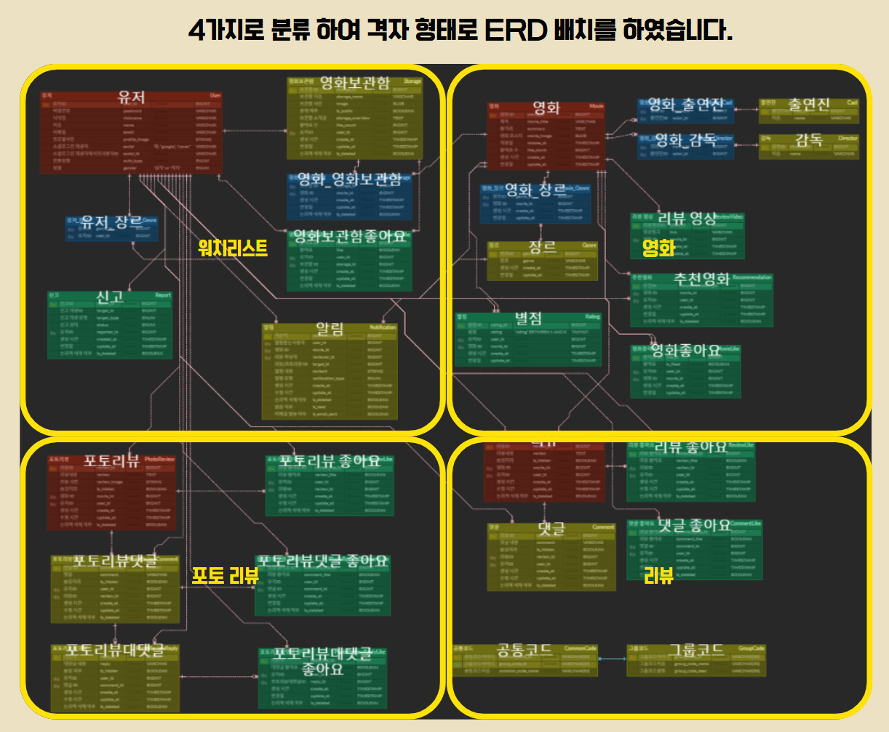

## 프로젝트 소개

PopFlix는 영화 정보를 기반으로 리뷰를 작성하고, 다른 사용자들과 의견을 공유할 수 있는 영화 리뷰 플랫폼입니다.

TMDB API를 활용하여 영화 데이터를 제공하고, JWT 기반 인증과 AWS 클라우드 환경을 구축하여 실제 서비스와 유사한 환경에서 개발을 진행했습니다.

프로젝트는 프론트엔드 4명, 백엔드 3명으로 구성된 팀 프로젝트로 약 **4주(2024.11 ~ 2024.12)** 동안 진행되었으며, GitHub Flow 기반 협업과 GitHub Actions를 활용한 CI/CD 환경을 구축하여 개발부터 배포까지 전 과정을 경험했습니다.

## 주요 특징 및 기능

* 🎬 **영화 정보 조회** : TMDB API를 활용한 영화 목록 및 상세 정보 제공
* ⭐ **리뷰 및 별점 기능** : 영화 리뷰 작성, 수정, 삭제 및 별점 등록
* 📁 **영화 보관함(Watch List)** : 관심 영화를 저장하고 관리하는 기능
* 🔐 **회원 인증** : JWT 및 OAuth2 기반 로그인 및 회원 관리
* ☁️ **CI/CD 구축** : GitHub Actions와 Docker를 활용한 자동 배포 환경 구성
* 🚀 **성능 최적화** : N+1 문제 해결을 통한 조회 성능 개선

## 사용 기술

| 구분                 | 기술                                                                                                                                                   |
| ------------------ | ---------------------------------------------------------------------------------------------------------------------------------------------------- |
| **Frontend**       | HTML5, CSS3, JavaScript                                                                                                                              |
| **Backend**        | Java 17, Spring Boot 3.5, Spring Security, JWT, OAuth2, Spring Data JPA (Hibernate), MySQL, RestTemplate, ModelMapper, Validation, Swagger (OpenAPI) |
| **Infrastructure** | AWS EC2, AWS S3, AWS RDS, Docker, GitHub Actions                                                                                                     |
| **Collaboration**  | Git, GitHub, Notion, Slack, Figma, Postman                                                                                                           |

## 내가 기여한 부분

### 📊 ERD 설계

* 전체 ERD 다이어그램 설계 및 구조 개선 (기여도 약 **80%**)
* 핵심 테이블과 매핑 테이블 관계 설계
* 1:N, M:N 관계 정의 및 매핑 테이블 구성
* 기능별 색상 분류를 통한 데이터 구조 가독성 향상 & 기능 별 Grid 형태 배열
    * 🟥 핵심/주요 테이블
    * 🟦 연관/매핑 테이블
    * 🟨 부가 정보 테이블
    * 🟩 로그/이력 테이블

### 💻 백엔드 개발

* 영화 CRUD API 구현
* 영화 보관함(Watch List) CRUD 구현
* REST API 설계 및 개발
* N+1 문제를 해결하여 조회 성능 개선

### 🚀 배포 및 CI/CD

* AWS EC2 기반 수동 배포 참여 (기여도 약 **70%**)
* GitHub Actions 기반 CI/CD 구축 (기여도 약 **70%**)
* Docker를 활용한 배포 환경 구성

### 🤝 협업

* Git & Notion 기반 협업 환경 구축
* Repository(front / back / model) 구조 분리 (기여도 약 **80%**)
* 프로젝트 컨벤션 및 브랜치 전략 수립 참여

## 트러블슈팅 및 극복 과정

### 🚨 문제

AWS 배포 환경에서 `MultipartFile`을 이용한 이미지 업로드 기능이 로컬 환경에서는 정상적으로 동작했지만, EC2에 배포한 이후 S3 업로드가 실패하는 문제가 발생했습니다.

### 🔍 원인 분석

배포 환경에서는 로컬과 달리 AWS IAM 권한과 S3 접근 정책이 적용되며, `MultipartFile`을 S3 객체로 변환하는 과정에서 파일 스트림 처리 방식에도 문제가 있었습니다.

또한 `application.properties`의 AWS 설정값과 배포 환경 설정을 함께 점검해야 했습니다.

### ✅ 해결 과정

* AWS IAM 권한 및 S3 Bucket 정책 재설정
* `application.properties`의 S3 설정 재검증
* MultipartFile 변환 및 파일 스트림 처리 로직 개선
* 업로드 파일명 생성 방식을 수정하여 충돌 및 스트림 누수 문제 해결

### 📈 결과

* 배포 환경에서도 이미지 업로드 기능 정상 동작
* 로컬과 운영 환경의 차이를 고려한 배포 경험 습득
* AWS 권한 관리와 파일 업로드 처리 과정에 대한 이해 향상

### 💡 배운 점

이번 문제를 해결하면서 **로컬 환경에서 정상적으로 동작하는 코드가 운영 환경에서도 반드시 동일하게 동작하는 것은 아니라는 점**을 체감했습니다.

특히 AWS 환경에서는 애플리케이션 코드뿐만 아니라 IAM 권한, 네트워크 정책, 환경 변수 설정까지 함께 고려해야 한다는 점을 배웠으며, 이후에는 배포 환경을 고려한 개발 습관을 갖게 되었습니다.
